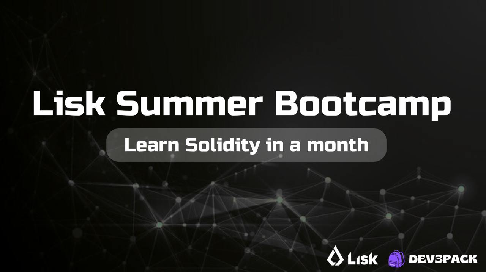

# Dev3Pack × Lisk Solidity Bootcamp 2025

**Join Google Meet at 4PM UTC on Tuesday and Thursday (2 hours)**  
[Join Meet](http://meet.google.com/jsw-kwms-jci)

---

## 📚 Main Resource Hub

- **All Bootcamp Materials, Schedule, and Resources:** [Lisk Summer Bootcamp Notion Page](https://frost-foe-274.notion.site/Lisk-Summer-Bootcamp-Solidity-226b6900a29980aa9ef4f15dd4d83774)

---

## 📺 Youtube Recordings

- [Lisk Summer Bootcamp Playlist](https://www.youtube.com/playlist?list=PLvimYWRMGIoUTjRolIl08sfIF5UL2o7_F)

---

## About the Bootcamp

Welcome to the Lisk Summer Bootcamp, a month-long journey to learn Solidity and blockchain development with Lisk and Dev3Pack! This bootcamp is designed for Web2 developers eager to dive into Web3, with a strong focus on both smart contracts and frontend integration. Sessions are interactive, hands-on, and led by experienced instructors.

- **When:** Every Tuesday & Thursday, 4PM UTC
- **Where:** Google Meet (link above)
- **Who:** Anyone interested in blockchain, Ethereum, Solidity, and dApp development
- **Format:** Live sessions, Q&A, homework, and community support

All sessions are recorded and uploaded to Youtube. Resources and homework are shared via Google Classroom.

---

## 🗓️ Bootcamp Schedule

| Date         | Session                                             | Objectives                                                                 | Focus                                                                 |
|--------------|-----------------------------------------------------|----------------------------------------------------------------------------|-----------------------------------------------------------------------|
| July 15      | Introduction to Blockchain, Ethereum and Superchain | Ensure participants understand the concept of blockchain, web3 and ethereum | Blockchain basics, Ethereum ecosystem                                  |
| July 17      | Solidity Fundamentals                              | Equip participants with basic programming skills in Solidity using Remix    | Syntax, data types, functions, storage                                 |
| July 22      | Smart Contracts                                    | Enable participants to write and deploy simple contracts                   | Inheritance, libraries, events                                         |
| July 24      | Advanced Solidity and Foundry                      | Prepare participants for more complex smart contract development           | Vulnerabilities, best practices, tools                                 |
| July 29      | Introduction to React - Core Concepts              | Gain foundational knowledge and practical skills for React UI development   | JSX, Components, Props, State, Events, Rendering                       |
| July 31      | Advanced React - Hooks & Data Flow                 | Master essential React Hooks and data flow patterns                        | useEffect, Context API, Composition, Error Handling                    |
| August 5     | Connecting frontend to smart contract - Setup & Basic Interaction | Set up a dApp environment and connect to Lisk smart contracts             | ethers.js, Blockchain connection, Reading contract data                |
| August 7     | Connecting Frontend to Smart Contract - Transactions & Advanced Interaction | Enable users to send transactions and handle real-time updates             | Wallets, Transactions, Events, UI updates, Error Handling              |
| Aug 29-31    | Aleph Hackathon                                    | Register here: <https://alephhackathon.notion.site/>                        |                                                                       |

---

## 📚 Session Access & Resources

- **Google Classroom:** All resources and homework will be shared here. [Join Classroom](https://classroom.google.com/u/1/c/Nzg4Njc3MDg1MTQw)
- **Telegram Group:** [Join Dev3pack Global](https://t.me/+I6kRJdl5THMyOWQ0)
- **Mentors & Instructors:** Available for support throughout the bootcamp.

---

## Contact & Support

- Email: [contact@dev3pack.xyz](mailto:contact@dev3pack.xyz)
- Youtube: [Dev3Pack Channel](https://www.youtube.com/@dev3pack)
- Telegram: [https://t.me/+I6kRJdl5THMyOWQ0](https://t.me/+I6kRJdl5THMyOWQ0)

---

## License

This project is licensed under the MIT License. See [LICENSE](LICENSE) for details.
