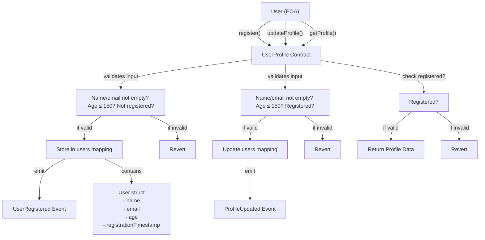

# UserProfile Contract Diagram

This updated diagram illustrates the improved `UserProfile` smart contract, now including input validation and event emission for registration and profile updates.

**Shown:**

- Input validation for registration and update (empty fields, age limit, registration status)
- Event emission (`UserRegistered`, `ProfileUpdated`) on successful actions
- Revert paths for invalid input or unauthorized actions
