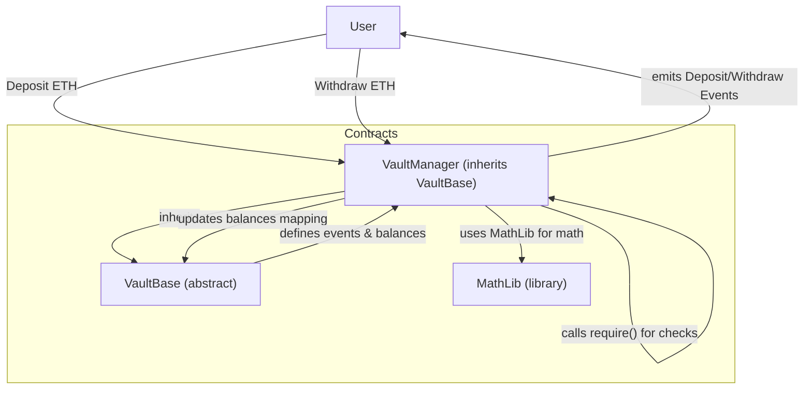

# Vault System Flow Diagram

```mermaid
flowchart TD
    User["User"]
    VaultManager["VaultManager (inherits VaultBase)"]
    VaultBase["VaultBase (abstract)"]
    MathLib["MathLib (library)"]

    User -- Deposit ETH --> VaultManager
    User -- Withdraw ETH --> VaultManager
    VaultManager -- emits Deposit/Withdraw Events --> User
    VaultManager -- uses MathLib for math --> MathLib
    VaultManager -- inherits --> VaultBase
    VaultManager -- updates balances mapping --> VaultBase
    VaultBase -- defines events & balances --> VaultManager
    VaultManager -- calls require() for checks --> VaultManager

    subgraph Contracts
        VaultManager
        VaultBase
        MathLib
    end
``` 