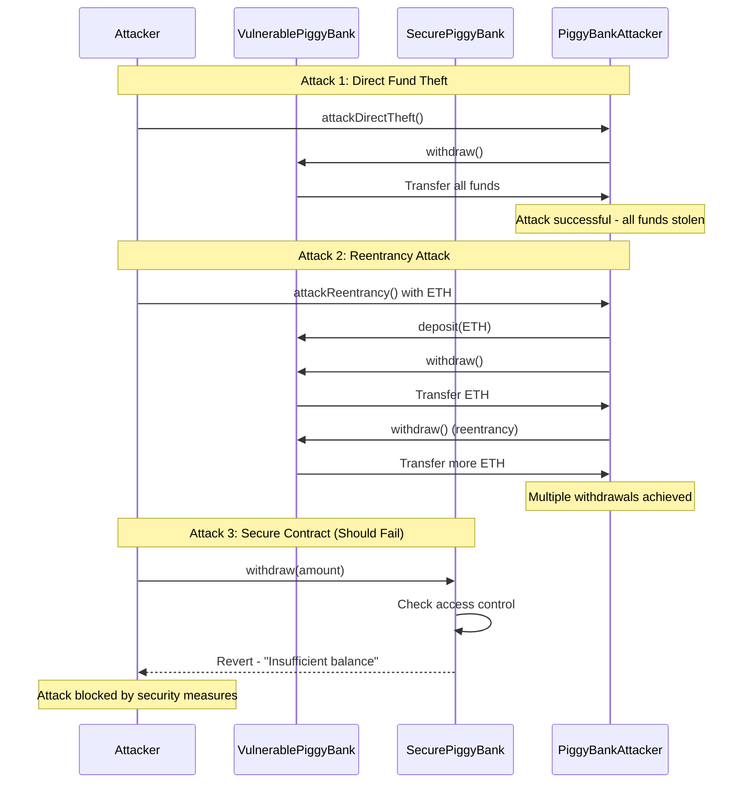

# PiggyBank Security Flow Diagram

## Attack Vectors and Security Fixes

```mermaid
flowchart TD
    A[VulnerablePiggyBank Contract] --> B{Attack Vectors}
    
    B --> C[Access Control Vulnerability]
    B --> D[Reentrancy Vulnerability]
    B --> E[DoS Vulnerability]
    B --> F[Lack of Events]
    B --> G[No Input Validation]
    
    C --> C1[Anyone can call withdraw()]
    C1 --> C2[All funds stolen]
    
    D --> D1[External call before state update]
    D1 --> D2[Reentrancy attack possible]
    D2 --> D3[Multiple withdrawals]
    
    E --> E1[transfer() with 2300 gas limit]
    E1 --> E2[Complex fallback functions fail]
    
    F --> F1[No transparency]
    F1 --> F2[Hard to track state changes]
    
    G --> G1[No input validation]
    G1 --> G2[Spam and inefficiency]
    
    H[SecurePiggyBank Contract] --> I{Security Fixes}
    
    I --> J[Access Control Fix]
    I --> K[Reentrancy Protection]
    I --> L[DoS Protection]
    I --> M[Event Logging]
    I --> N[Input Validation]
    
    J --> J1[Only users can withdraw their deposits]
    J1 --> J2[Owner emergency withdrawal]
    
    K --> K1[ReentrancyGuard modifier]
    K1 --> K2[State updates before external calls]
    
    L --> L1[Use call() instead of transfer()]
    L1 --> L2[Proper error handling]
    
    M --> M1[Deposit events]
    M --> M2[Withdrawal events]
    M --> M3[Emergency withdrawal events]
    
    N --> N1[Check for zero values]
    N --> N2[Validate addresses]
    N --> N3[Match sent value with specified amount]
    
    O[Attack Demonstrations] --> P[PiggyBankAttacker Contract]
    
    P --> Q[Direct Fund Theft]
    P --> R[Reentrancy Attack]
    P --> S[Front-running Attack]
    P --> T[DoS Attack]
    
    Q --> Q1[attackDirectTheft()]
    Q1 --> Q2[Steals all funds from vulnerable contract]
    
    R --> R1[attackReentrancy()]
    R1 --> R2[receive() function triggers reentrancy]
    
    S --> S1[attackFrontRunning()]
    S1 --> S2[Simulates MEV bot attack]
    
    T --> T1[attackDoS()]
    T1 --> T2[Demonstrates gas limit vulnerability]
    
    U[Security Best Practices] --> V[Implementation]
    
    V --> W[Use OpenZeppelin libraries]
    V --> X[Follow Checks-Effects-Interactions pattern]
    V --> Y[Implement proper access control]
    V --> Z[Emit events for transparency]
    V --> AA[Validate all inputs]
    V --> BB[Use safe external calls]
    V --> CC[Test thoroughly]
    V --> DD[Stay updated with security practices]
```

## Attack Flow



## Security Fix Flow

```mermaid
flowchart LR
    A[Vulnerable Contract] --> B[Security Analysis]
    B --> C[Identify Vulnerabilities]
    C --> D[Implement Fixes]
    D --> E[Secure Contract]
    
    C --> C1[Access Control]
    C --> C2[Reentrancy]
    C --> C3[DoS]
    C --> C4[Events]
    C --> C5[Validation]
    
    D --> D1[OpenZeppelin Ownable]
    D --> D2[ReentrancyGuard]
    D --> D3[Use call() instead of transfer()]
    D --> D4[Emit events]
    D --> D5[Input validation]
    
    E --> E1[Test thoroughly]
    E1 --> E2[Deploy securely]
    E2 --> E3[Monitor for issues]
```
