# 🚀 What is Blockchain? A Beginner’s Guide for Web3 Learners

---

## 📘 Introduction

Blockchain is reshaping digital trust and ownership, enabling innovations like Bitcoin, Ethereum, and Web3. But what exactly is a blockchain, and why is it so important? This article breaks down blockchain in simple terms, with visuals, analogies, and practical examples for absolute beginners.

> **TL;DR:** Blockchain = digital trust, transparency, and ownership. Let’s make it fun!

---

## 🧠 What is Blockchain?

A **blockchain** is a decentralized, distributed ledger that records transactions across multiple computers (nodes) in a secure, transparent, and tamper-resistant way. It eliminates the need for intermediaries by enabling peer-to-peer transactions that are verifiable and permanent.

> 📝 **Analogy:** Think of blockchain as a magical notebook that everyone can see, but no one can erase or secretly change.

---

## 🔑 Key Characteristics of Blockchain

- 🏛️ **Decentralization:** No single entity controls the network; transactions are verified by multiple participants (nodes).
- 🛡️ **Immutability:** Once data is recorded, it cannot be altered or deleted (except in rare events like major chain reorganizations or forks), ensuring integrity.
- 👀 **Transparency:** Transactions are publicly visible, enhancing trust.
- 🔒 **Security:** Cryptographic techniques secure transactions, preventing fraud and unauthorized modifications.

---

## 🧱 Block + Chain: How It Works

A blockchain is made up of blocks, each containing:

- 📄 A list of transactions (often organized using a **Merkle Tree**, which allows efficient verification without downloading the entire dataset)
- 🕒 A timestamp (provides a record of when the block was created)
- 🔗 A reference (hash pointer) to the previous block (ensures blocks are linked securely)

Blocks are linked together, forming a chain. If one block is tampered with, the entire chain becomes invalid.

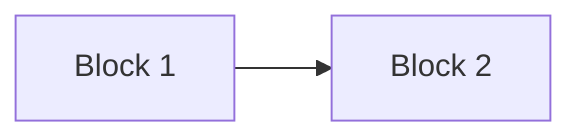

> 🧩 **Visual:** Each block is like a page in a diary, and the hash is a secret code linking each page to the next.

---

## 🌍 Centralized vs. Decentralized

| Feature             | Centralized Database | Blockchain (Decentralized)            |
| ------------------- | -------------------- | ------------------------------------- |
| Controlled by       | One organization     | Many independent participants (nodes) |
| Vulnerable to hacks | Yes                  | Much harder due to consensus          |
| Can be edited       | Yes                  | No (immutable)                        |

> 🏢 **Centralized:** Like a single bank keeping everyone’s money records.
>
> 🌐 **Decentralized:** Like everyone in the village keeping a copy of the ledger!

---

## 🧾 Real-Life Analogy: The Google Doc

> ✍️ **Imagine:**
>
> - A Google Doc shared with your entire class.
> - Everyone can view changes in real-time.
> - Once a sentence is typed, it stays permanently.
> - Everyone has a copy—if one person tries to cheat, it’s easy to detect.
>
> That’s blockchain!

---

## 🔐 The Role of Cryptography

Blockchain uses **asymmetric cryptography**:

- **Public key:** Shared with others (like your email)
- **Private key:** Like a secret signature only you can make—it’s generated by your wallet, not chosen like a password. Used to sign transactions.

📌 *You can share your public key, but never your private key.*

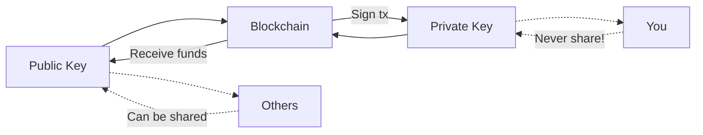

> 🗝️ **Visual:** Your public key is your mailbox address. Your private key is the key to open it—never give it away!

---

## 🏛️ Types of Blockchains

- 🌎 **Public Blockchains:** Open to everyone (e.g., Ethereum, Bitcoin)
- 🏢 **Private Blockchains:** Controlled by organizations (e.g., for supply chains)

---

## ⚙️ Consensus Mechanisms

Consensus mechanisms are protocols that ensure all nodes agree on the blockchain’s state. Common types:

- ⛏️ **Proof of Work (PoW):** Used by Bitcoin; miners solve puzzles to validate transactions.
- 🪙 **Proof of Stake (PoS):** Used by Ethereum 2.0, Lisk, and others; validators are selected probabilistically in proportion to their stake, sometimes with added randomness or bonding mechanisms. Validators are also financially incentivized to act honestly via slashing penalties if they behave maliciously.

> 🧠 **Analogy:** PoW is like a math contest; PoS is like a lottery where you buy more tickets with more coins.

---

## 🧊 The Blockchain Trilemma

Every blockchain faces a fundamental challenge: it can’t optimize for all three properties at once:

| Combination                  | Example           | Trade-off            |
|------------------------------|-------------------|----------------------|
| Decentralization + Security  | Bitcoin           | Slow, not scalable   |
| Security + Scalability       | Solana            | Less decentralized   |
| Decentralization + Scalability | Some experimental chains | Less secure      |

> ⚠️ **Trilemma:** You can’t optimize for all three! Most blockchains prioritize two and compromise on the third.

---

## 🧥 Layering Principle: Why Blockchains Use Layers

Just as you layer clothes for harsh winters (base, insulation, shell), blockchains use layers for resilience and flexibility:

- **Layer 1 (L1):** The base blockchain (e.g., Ethereum, Bitcoin)
- **Layer 2 (L2):** Scaling solutions built on top of L1 (e.g., rollups)
- **Layer 3 (L3):** App-specific chains for games or high-performance apps

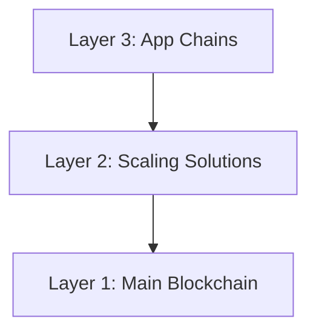

> 🧤 **Analogy:** L1 is your thermal underwear, L2 is your fleece, L3 is your windbreaker. Each layer adds protection and flexibility!

---

## 🧰 Rollups Unrolled: Optimistic, ZK, and Experimental Rollups (ELVES)

Rollups help blockchains scale by bundling many transactions into one, sending a summary to the main chain, and keeping the detailed work off-chain. Think of it like mailing a spreadsheet instead of sending each number one by one.

> 📦 **Visual:** Rollups = packing lots of small packages into one big box for delivery!

### Why Do We Need Rollups?

- Blockchains are secure and decentralized, but can be slow and expensive.
- Rollups = scalability + security

### Types of Rollups

#### 😉 Optimistic Rollups: "Trust Me... Until Proven Wrong"

- Assume transactions are valid unless challenged.
- Use a challenge period (delays finality, e.g., up to 7 days). Finality is delayed in optimistic rollups due to the challenge window.
- Cheaper and easier to scale than Layer 1.
- **Pros:** Lower fees, easier to build with.
- **Cons:** Delayed withdrawals, relies on users to catch fraud.

#### ✨ ZK-Rollups: "I Can Prove It With Math!"

- Use cryptographic proofs (ZK-SNARKs/STARKs) to prove all transactions are valid.
- Near-instant finality once the validity proof is verified on L1, strong security guarantees.
- **Analogy:** Like a math teacher checking homework by verifying the answers without seeing the work.
- **Pros:** Very secure, fast confirmation, great for privacy/high-throughput.
- **Cons:** Complex to build, proving takes time and powerful hardware.

#### 🤔 Experimental Rollups (ELVES): "Trust Nothing. Verify Everything."

- This is a theoretical or experimental framework, not a mainstream rollup type. Some research protocols (like ELVES) propose assuming everything is wrong unless proven right, using committees to check blocks and penalize fraud.
- **Pros:** Very secure, resilient to attacks, fast auditing.
- **Cons:** New and complex, less tested.

---

### ⚖️ Side-by-Side Comparison

| Feature           | Optimistic         | ZK-Rollup         | Experimental (ELVES)      |
|-------------------|-------------------|-------------------|----------------------|
| Validity Method   | Assume valid, check if challenged | Prove validity upfront | Assume invalid, prove valid |
| Finality          | Delayed (challenge window) | Near-instant (once proof verified on L1) | Depends on committee result |
| Cost              | Low                | High (proving is expensive) | Medium (committee + slashing) |
| Security          | Relies on watchers | Strong cryptographic proof | Strong + game-theoretic |
| Example Projects  | Arbitrum, Optimism | zkSync, StarkNet, Scroll | No mainstream implementations yet |

> 🏁 **Summary Table:** Each rollup type has its own strengths and trade-offs. Pick what fits your use case!

---

## 🏗️ How Rollups Work (Step-by-Step)

1. **Collection:** Users submit transactions to the L2 network.
2. **Bundling:** A sequencer collects and orders transactions.
3. **Compression:** Multiple transactions are compressed into a single batch.
4. **L1 Submission:** The batch is submitted to L1 as one transaction.
5. **Cost Sharing:** L1 gas fees are split among all users in the batch.

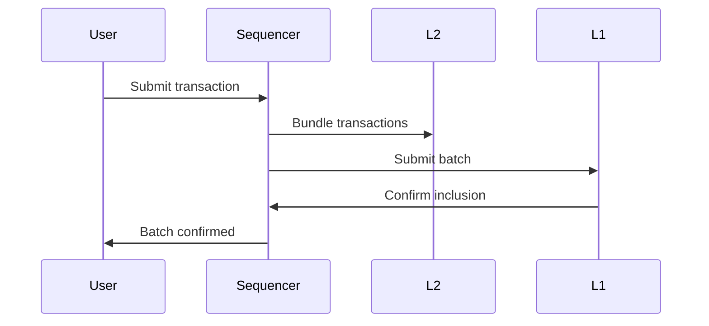

> 📊 **Visual:** Like a group of friends pooling money to send one big package instead of many small ones!

---

## 🏢 Sequencers: The Critical Infrastructure

Sequencers are specialized operators that manage L2 transaction flow and batching. They help reduce latency and enable fast confirmations, but may introduce front-running risks if not designed with MEV (Maximal Extractable Value) protection.

> ⚡ **Fun Fact:** Most rollups today use a single sequencer, but the future is multi-sequencer for more security!

**Risks:**

- Centralization: Most rollups currently use single, centralized sequencers.
- Downtime: If sequencers fail, users may lose access to standard L2 interfaces (though advanced users can interact via L1 contracts).
- Front-running: Sequencers may be able to reorder transactions for profit unless MEV protection is implemented.

**Mitigations:**

- Uptime monitoring feeds
- Grace periods to prevent mass liquidations
- Progressive decentralization toward multiple sequencers
- Fair ordering and MEV mitigation techniques

---

## 🏁 Rollup Maturity: The Three Stages

| Stage | Governance | Proof System | Exit Mechanism | Decentralization Level | Example |
|-------|------------|--------------|---------------|-----------------------|---------|
| 0     | Operators & Security Council | Centralized or training-wheels | 7-day exit, operator help | Centralized | Most new rollups |
| 1     | Smart contracts + council | Decentralized proof submission | Independent user exits | Semi-decentralized | Many established rollups |
| 2     | Fully smart contract-based | Permissionless proof generation | Fully decentralized, robust exits | Fully decentralized | Target for future |

> 🏆 **Goal:** Most rollups are working toward Stage 2—fully decentralized and permissionless!

---

## 🧠 What Are Smart Contracts?

A **smart contract** is a self-executing program stored on the blockchain. It runs automatically when conditions are met. (Note: Smart contracts are not AI—they are programs with predefined rules, not chatbots or learning systems.)

> 💡 **Example:**
> “If Alice sends 1 ETH to Bob, release the NFT to Alice.”

Smart contracts are used in:

- DeFi (Decentralized Finance)
- NFTs
- DAOs

---

## 🗳️ DAOs: Decentralized Autonomous Organizations

A **DAO** is a decentralized organization governed by token holders. The community votes on proposals, budgets, and roadmaps.

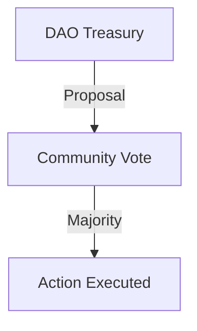

- **Voting tools:** [Snapshot](https://snapshot.org), [Tally](https://tally.xyz)

> 🗳️ **Analogy:** A DAO is like a club where every member gets a vote, and the rules are enforced by code!

---

## 🏦 Real-World Applications

- 💸 **Banking:** Tokenize accounts, on-chain assets
- 🏛️ **CBDCs:** Central Bank Digital Currencies ([Consensys CBDC](https://consensys.io/solutions/payments-and-money/cbdc))
- 🚚 **Supply Chain, Healthcare, Voting, and more**

---

## 🔒 Is Blockchain Safe?

Yes, but not 100%. Blockchain ensures data security at the protocol level, but app-layer vulnerabilities still exist. Smart contracts need **audits** to avoid vulnerabilities.

**Common threats:**

- 🧵 Reentrancy attacks
- 👥 Sybil attacks in DAOs (fake votes)
- 🧰 Poorly written code

🔍 Tools like **Remix IDE** help test for issues.
💰 Audits are expensive but necessary—especially for financial apps.

🦺 **Safety Tip:** **NEVER share your private key!** Always double-check smart contract code.

---

## 🛠️ Tools to Explore

| Tool                                         | Purpose                        |
| -------------------------------------------- | ------------------------------ |
| [MetaMask](https://metamask.io/)             | Web3 wallet                    |
| [Remix IDE](https://remix.ethereum.org/)     | Smart contract testing         |
| [Chainlist](https://chainlist.org)           | Add blockchain networks easily |
| [L2Beat](https://l2beat.com/scaling/summary) | Compare Layer 2 networks       |
| [Rekt](https://rekt.news/)                   | List of major DeFi hacks       |
| [Ethereum Foundation](https://ethereum.org/) | Ethereum official resources    |
| [Bitcoin.org](https://bitcoin.org/)          | Bitcoin official resources     |

---

## 💡 Key Points & Highlights

- Blockchain is a decentralized, tamper-proof digital ledger.
- It uses cryptography for security and transparency.
- Smart contracts automate agreements and power DeFi, NFTs, and DAOs.
- Public and private blockchains serve different use cases.
- Consensus mechanisms keep the network in sync.
- Rollups are essential for scaling and come in different types (Optimistic, ZK, Experimental/ELVES).
- Sequencers and rollup maturity are critical for L2 security and decentralization.
- Always keep your private key secret!

---

## 📝 Summary

Blockchain is transforming the way we handle trust, transparency, and digital ownership. Understanding the trilemma, layering, and rollups is key to navigating the future of Web3.

> 🎉 **You made it!** Whether you’re a developer, designer, or just curious, you’re now ready to explore the world of blockchain with confidence.

---

## 🌟 Helpful Resources

- **Solidity Documentation:** [docs.soliditylang.org](https://docs.soliditylang.org/en/v0.8.30/?authuser=1)
- **Solidity by Example:** [solidity-by-example.org](https://solidity-by-example.org/?authuser=1)
- **Cyfrin Solidity Course:** [Updraft Solidity Course](https://updraft.cyfrin.io/courses/solidity?authuser=1)
- **Lisk Scaffold (Starter Kit):** [github.com/LiskHQ/scaffold-lisk](https://github.com/LiskHQ/scaffold-lisk?authuser=1)
- **React Official Tutorial:** [react.dev/learn](https://react.dev/learn?authuser=1)
- **Ethers.js Documentation:** [docs.ethers.org/v5](https://docs.ethers.org/v5/?authuser=1)
- **Viem (Web3 Library):** [viem.sh](https://viem.sh/?authuser=1)
- **Next.js Learn:** [nextjs.org/learn](https://nextjs.org/learn?authuser=1)
- **Foundry (Smart Contract Tooling):** [getfoundry.sh](https://getfoundry.sh/?authuser=1)
- **Wagmi (React Web3 Hooks):** [wagmi.sh](https://wagmi.sh/?authuser=1)
- **Ethereum Foundation:** [ethereum.org](https://ethereum.org/)
- **Bitcoin.org:** [bitcoin.org](https://bitcoin.org/)

---

## 📚 Glossary

- **ZK-SNARKs:** Zero-Knowledge Succinct Non-Interactive Argument of Knowledge. A cryptographic proof that allows one party to prove to another that a statement is true, without revealing any information beyond the validity of the statement itself.
- **Finality:** The point at which a transaction is considered permanent and cannot be reversed.
- **Sequencer:** An operator in Layer 2 rollups responsible for ordering and batching transactions before submitting them to Layer 1.
- **Rollup:** A Layer 2 scaling solution that bundles multiple transactions into a single batch for efficiency.
- **Fraud Proof:** A mechanism in optimistic rollups that allows anyone to challenge the validity of a transaction during the challenge period.
- **Smart Contract:** A self-executing program on the blockchain that runs when predefined conditions are met. (Not AI—just code, not a chatbot!)
- **DAO:** Decentralized Autonomous Organization, a community-led entity with no central authority, governed by smart contracts and token holders.
- **Challenge Period:** The time window in optimistic rollups during which transactions can be disputed.
- **Slashing:** The act of penalizing a validator or participant (usually by taking away staked funds) for malicious or incorrect behavior.
- **L1/L2:** Layer 1 is the base blockchain; Layer 2 is a scaling solution built on top of Layer 1.
- **Consensus Mechanism:** The protocol by which blockchain nodes agree on the state of the network (e.g., Proof of Work, Proof of Stake).
- **Merkle Tree:** A tree-like data structure that allows efficient and secure verification of the contents of large data sets, used in blockchains to organize transactions within a block.
- **MEV (Maximal Extractable Value):** The maximum value that can be extracted from block production by including, excluding, or reordering transactions within a block.

---

## 🌳 Merkle Tree: Efficient Transaction Verification

A **Merkle Tree** allows blockchains to efficiently and securely verify large sets of transactions. Each transaction is hashed, then pairs of hashes are combined and hashed again, up to a single Merkle root.

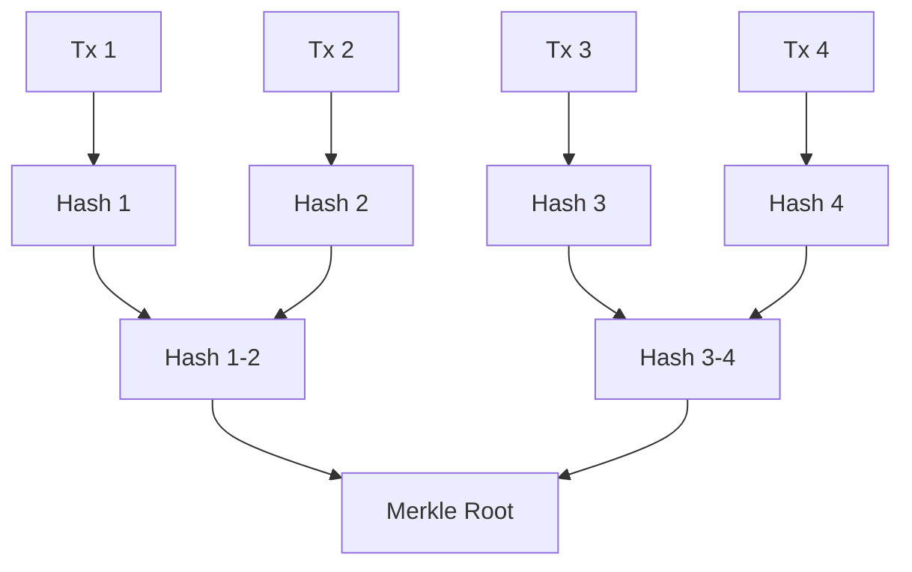

> 🌲 **Visual:** Like combining branches up to a single trunk—the Merkle root summarizes all transactions!

---

## 🔺 The Blockchain Trilemma (Visual)

Blockchains must balance three properties: Decentralization, Security, and Scalability. Most can only optimize for two at a time.

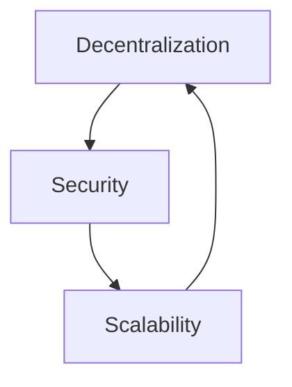

*Examples:*

- **Bitcoin:** Decentralization + Security
- **Solana:** Security + Scalability
- **Experimental chains:** Decentralization + Scalability

> 🔺 **Visual:** The trilemma triangle—pick any two, but not all three!

---

## ⚡ Proof of Work vs. Proof of Stake (Visual)

**Proof of Work (PoW):**

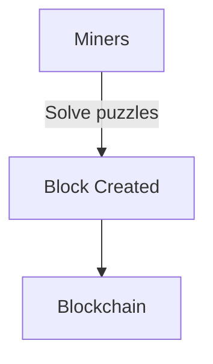

**Proof of Stake (PoS):**

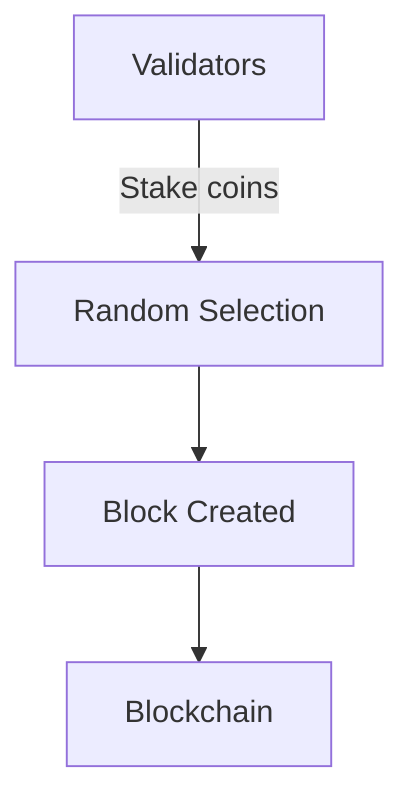

> ⚡ **Visual:** PoW = work for rewards; PoS = stake for a chance to validate!

---

## 💸 MEV: Maximal Extractable Value (Visual)

MEV occurs when a sequencer or validator can reorder transactions for profit.

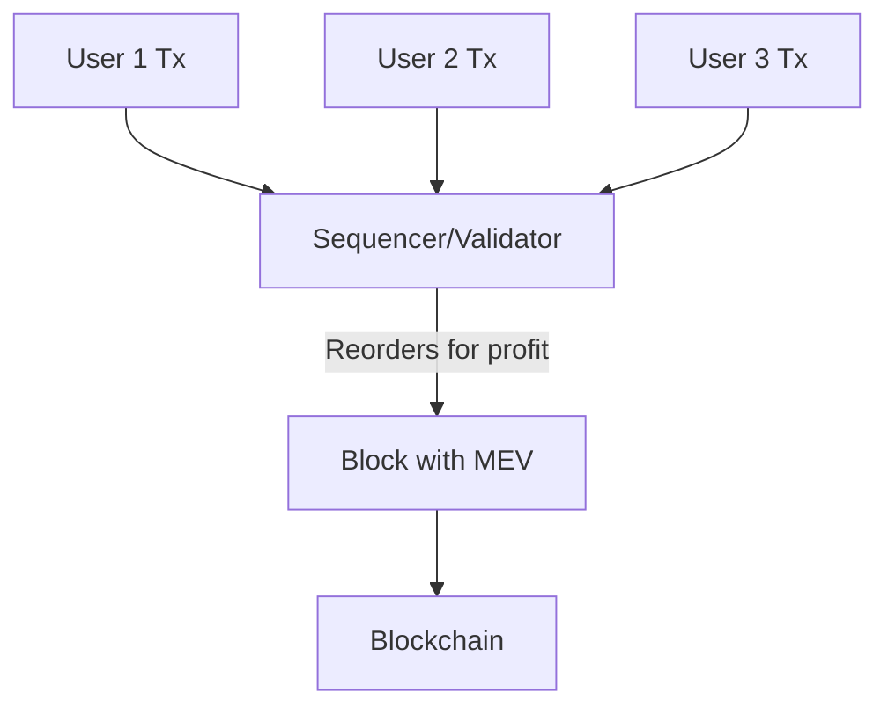

> 💸 **Visual:** Sequencers can profit by reordering transactions—MEV risk!

---

## 🧅 Layered Security Model (Visual)

Blockchain security is layered: protocol, consensus, smart contracts, and user practices all matter.

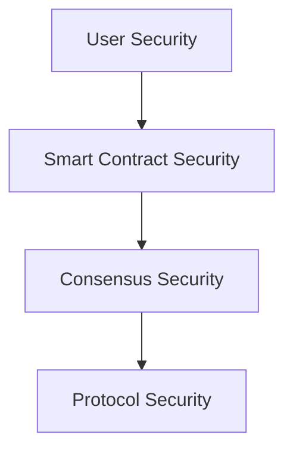

> 🧅 **Visual:** Like layers of an onion—each layer adds protection!
