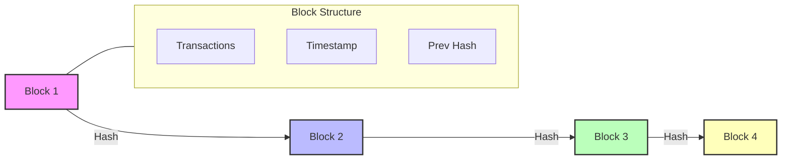
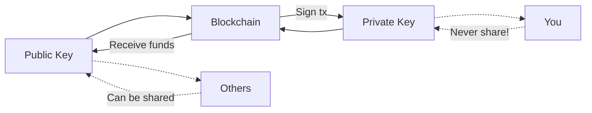
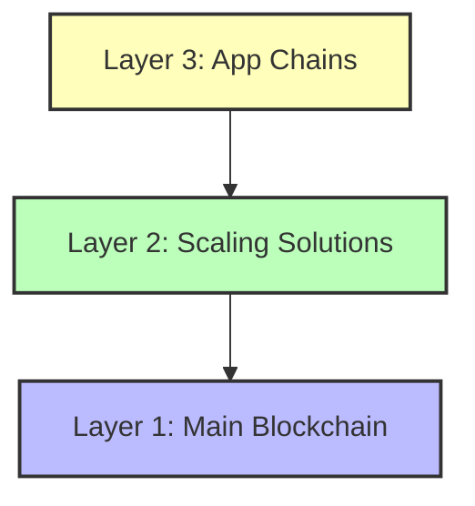
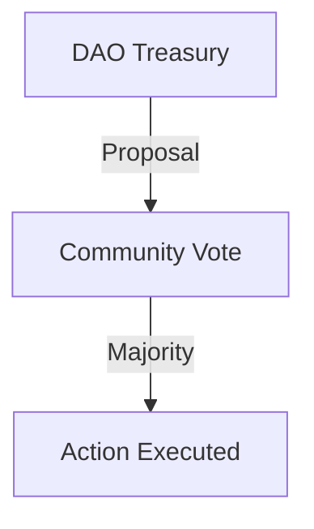

# What is Blockchain? A Beginner’s Guide for Web3 Learners

---

## 📘 Introduction

Blockchain is one of the most revolutionary technologies of the 21st century, powering innovations like Bitcoin, Ethereum, NFTs, and the entire Web3 movement. But what exactly is a blockchain, and why is it so important? This article breaks down blockchain in simple terms, with visuals, analogies, and practical examples for absolute beginners.

---

## 🧠 What is Blockchain?

A **blockchain** is a decentralized, distributed ledger that records transactions across multiple computers (nodes) in a secure, transparent, and tamper-resistant way. It eliminates the need for intermediaries by enabling peer-to-peer transactions that are verifiable and permanent.

---

## 🔑 Key Characteristics of Blockchain

- **Decentralization:** No single entity controls the network; transactions are verified by multiple participants (nodes).
- **Immutability:** Once data is recorded, it cannot be altered or deleted, ensuring integrity.
- **Transparency:** Transactions are publicly visible, enhancing trust.
- **Security:** Cryptographic techniques secure transactions, preventing fraud and unauthorized modifications.

---

## 🧱 Block + Chain: How It Works

A blockchain is made up of blocks, each containing:

- A list of transactions
- A timestamp
- A reference (hash) to the previous block

Blocks are linked together, forming a chain. If one block is tampered with, the entire chain becomes invalid.

---

## 🌍 Centralized vs. Decentralized

| Feature             | Centralized Database | Blockchain (Decentralized)            |
| ------------------- | -------------------- | ------------------------------------- |
| Controlled by       | One organization     | Many independent participants (nodes) |
| Vulnerable to hacks | Yes                  | Much harder due to consensus          |
| Can be edited       | Yes                  | No (immutable)                        |

---

## 🧾 Real-Life Analogy: The Google Doc

Imagine a **Google Doc** shared with your entire class:

- Everyone can view changes in real-time.
- Once a sentence is typed, it stays permanently.
- Everyone has a copy—if one person tries to cheat, it’s easy to detect.

That’s blockchain!

---

## 🔐 The Role of Cryptography

Blockchain uses **asymmetric cryptography**:

- **Public key:** Shared with others (like your email)
- **Private key:** Secret! Used to sign transactions (like your password)

📌 *You can share your public key, but never your private key.*

---

## 🏛️ Types of Blockchains

- **Public Blockchains:** Open to everyone (e.g., Ethereum, Bitcoin)
- **Private Blockchains:** Controlled by organizations (e.g., for supply chains)

---

## ⚙️ Consensus Mechanisms

Consensus mechanisms are protocols that ensure all nodes agree on the blockchain’s state. Common types:

- **Proof of Work (PoW):** Used by Bitcoin; miners solve puzzles to validate transactions.
- **Proof of Stake (PoS):** Used by Ethereum 2.0, Lisk, and others; validators are chosen based on their stake.

---

## 🌐 Layers in Blockchain

- **Layer 1:** Base chain (Ethereum, Bitcoin)
- **Layer 2:** Scaling solutions (Lisk, Celo, Base)
- **Layer 3:** App-specific chains (Madara, games)

---

## 🧠 What Are Smart Contracts?

A **smart contract** is a self-executing program stored on the blockchain. It runs automatically when conditions are met.

**Example:**
“If Alice sends 1 ETH to Bob, release the NFT to Alice.”

Smart contracts are used in:

- DeFi (Decentralized Finance)
- NFTs
- DAOs

---

## 🗳️ DAOs: Decentralized Autonomous Organizations

A **DAO** is a decentralized organization governed by token holders. The community votes on proposals, budgets, and roadmaps.

- **Voting tools:** [Snapshot](https://snapshot.org), [Tally](https://tally.xyz)

---

## 🏦 Real-World Applications

- **Banking:** Tokenize accounts, on-chain assets
- **CBDCs:** Central Bank Digital Currencies ([Consensys CBDC](https://consensys.io/solutions/payments-and-money/cbdc))
- **Supply Chain, Healthcare, Voting, and more**

---

## 🔒 Is Blockchain Safe?

Yes, but not 100%. Smart contracts need **audits** to avoid vulnerabilities.

**Common threats:**

- 🧵 Reentrancy attacks
- 👥 Sybil attacks in DAOs (fake votes)
- 🧰 Poorly written code

🔍 Tools like **Remix IDE** help test for issues.
💰 Audits are expensive but necessary—especially for financial apps.

---

## 🛠️ Tools to Explore

| Tool                                         | Purpose                        |
| -------------------------------------------- | ------------------------------ |
| [MetaMask](https://metamask.io/)             | Web3 wallet                    |
| [Remix IDE](https://remix.ethereum.org/)     | Smart contract testing         |
| [Chainlist](https://chainlist.org)           | Add blockchain networks easily |
| [L2Beat](https://l2beat.com/scaling/summary) | Compare Layer 2 networks       |
| [Rekt](https://rekt.news/)                   | List of major DeFi hacks       |

---

## 💡 Key Points & Highlights

- Blockchain is a decentralized, tamper-proof digital ledger.
- It uses cryptography for security and transparency.
- Smart contracts automate agreements and power DeFi, NFTs, and DAOs.
- Public and private blockchains serve different use cases.
- Consensus mechanisms keep the network in sync.
- Always keep your private key secret!

---

## 📝 Summary

Blockchain is transforming how we think about trust, transparency, and digital ownership. Whether you’re a developer, designer, or just curious, understanding blockchain is your first step into the world of Web3.

---

## 🌟 Helpful Resources

- **Solidity Documentation:** [docs.soliditylang.org](https://docs.soliditylang.org/en/v0.8.30/?authuser=1)
- **Solidity by Example:** [solidity-by-example.org](https://solidity-by-example.org/?authuser=1)
- **Cyfrin Solidity Course:** [Updraft Solidity Course](https://updraft.cyfrin.io/courses/solidity?authuser=1)
- **Lisk Scaffold (Starter Kit):** [github.com/LiskHQ/scaffold-lisk](https://github.com/LiskHQ/scaffold-lisk?authuser=1)
- **React Official Tutorial:** [react.dev/learn](https://react.dev/learn?authuser=1)
- **Ethers.js Documentation:** [docs.ethers.org/v5](https://docs.ethers.org/v5/?authuser=1)
- **Viem (Web3 Library):** [viem.sh](https://viem.sh/?authuser=1)
- **Next.js Learn:** [nextjs.org/learn](https://nextjs.org/learn?authuser=1)
- **Foundry (Smart Contract Tooling):** [getfoundry.sh](https://getfoundry.sh/?authuser=1)
- **Wagmi (React Web3 Hooks):** [wagmi.sh](https://wagmi.sh/?authuser=1)

---

*Written for the Lisk Summer Bootcamp – Week 1 Homework*
