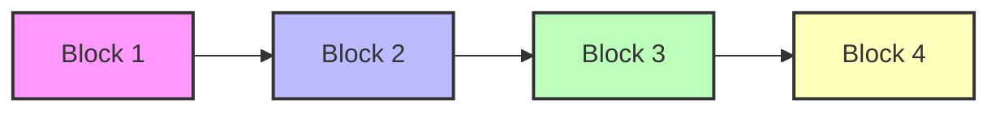
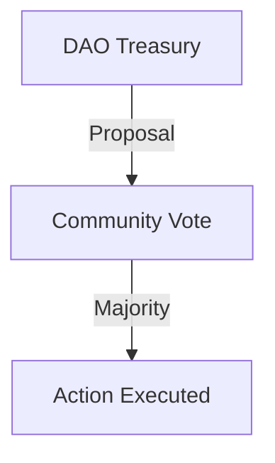

# 🪙 Lisk Summer Bootcamp  

## Week 1, Lecture 1 – Introduction to Blockchain

---

## ✅ What is Blockchain?

> **A decentralized, tamper-proof digital ledger that records transactions across a network.**

**Key Properties:**

- **Distributed ledger:** Data is shared across many computers (nodes).
- **Public, immutable, permissionless:** Anyone can join, and records can’t be changed.
- **No single controller:** Peer-to-peer, not owned by one entity.

---

### 🔗 Visual: Blockchain as a Chain of Blocks

---

## 🧠 Smart Contracts

- **What?** Programs stored on the blockchain that run when conditions are met.
- **Why?** Automate agreements, enable DeFi, DAOs, NFTs, and more.
- **Security:** Must be audited before launch (especially in DeFi).
- **Risks:** Vulnerabilities like reentrancy, brute-force attacks, or poor code can be exploited.
- **Tools:** [Remix IDE](https://remix.ethereum.org/) for testing and debugging.

**Further Reading:**  

- [rekt.news – Web3 hacks](https://rekt.news/)

---

## 🗳️ DAOs (Decentralized Autonomous Organizations)

- **Definition:** Community-run organizations where token holders vote on decisions.
- **How?** Voting power = token ownership.
- **Tools:** [Snapshot](https://snapshot.box/#/explore), [Tally](https://www.tally.xyz)
- **Example:** [Lisk DAO burn vote](https://www.tally.xyz/gov/lisk/proposal/109529319231798472455931112461964493964262461314287853501160335464858704295202)

---

## 🔐 Cryptography Basics

- **Public Key:** Shareable, used to receive funds/messages.
- **Private Key:** Secret, never share!
- **Encryption:** Blockchain uses asymmetric encryption.

**Learn More:**  

- [Symmetric vs Asymmetric](https://encryptinsights.com/symmetric-vs-asymmetric-encryption/)  
- [Ethereum Keys (GitHub)](https://github.com/ethereumbook/ethereumbook/blob/develop/04keys-addresses.asciidoc)

---

## 🌐 Layers in Blockchain

| Layer      | Description                                 | Examples                |
|------------|---------------------------------------------|-------------------------|
| **Layer 1**| Base chain, main network                    | Ethereum, Bitcoin       |
| **Layer 2**| Scales L1, bundles transactions, uses L1 security | Lisk, Celo, Base (OP Stack) |
| **Layer 3**| For high-performance apps (e.g., games)     | Starknet/Madara         |

- **Superchain Ecosystem:** Lisk, Celo, Base (built on OP Stack)
- **Rollup Comparison:** [L2Beat](https://l2beat.com/scaling/summary)
- **Appchains Example:** [madara.build](https://www.madara.build/)

---

## 🏦 Real-World Applications

- **Banking:** Tokenize accounts, on-chain assets.
- **CBDCs:** Central Bank Digital Currencies ([Consensys CBDC](https://consensys.io/solutions/payments-and-money/cbdc))

---

## ⚖️ Decentralization vs. Regulation

- **Public blockchains:** Open, anyone can join (Ethereum, Lisk).
- **Private blockchains:** Controlled, permissioned (e.g., government).
- **Regulation:** Adds compliance, but doesn’t centralize public chains.

---

## 📚 Learning & Tools

- **Main Curriculum:** [Lisk Solidity Bootcamp Notion](https://frost-foe-274.notion.site/Lisk-Summer-Bootcamp-Solidity-226b6900a29980aa9ef4f15dd4d83774?pvs=74)
- **Ethereum Blocks:** [Docs](https://ethereum.org/en/developers/docs/blocks/)
- **Slide Deck:** [Lisk Superchain Deck](https://docs.google.com/presentation/d/1lDN2TA57TveBsLBImUzUbpj7cUvuNyqMvtkr0WKf0cg/edit#slide=id.p)
- **Add Lisk Network:** [Chainlist](https://chainlist.org/?chain=1135&testnets=true&search=Lisk)
- **Google Classroom:** [Join here](https://classroom.google.com/c/Nzg4Njc3MDg1MTQw?cjc=kb7uvwr3)

---

## ⚠️ Extra Tips

- **Attendance:** Mark in “Tasks > Attendance” in Classroom.
- **Wallets:** MetaMask is beginner-friendly.

---

### 💬 Sample Community Chat Highlights

- “Blockchain is a decentralized, tamper-proof digital ledger that records transactions across a network of computers.”
- “Smart contracts are a part of the data in the blocks.”
- “Dev3Pack is like a DAO: shared ownership, collective decision-making, and learning powered by the community.”

---

**For more, visit the [Notion Resource Hub](https://frost-foe-274.notion.site/Lisk-Summer-Bootcamp-Solidity-226b6900a29980aa9ef4f15dd4d83774?pvs=74).**

---

## 🌟 Helpful Resources

- **Solidity Documentation:** [docs.soliditylang.org](https://docs.soliditylang.org/en/v0.8.30/?authuser=1)
- **Solidity Official Site:** [soliditylang.org](https://soliditylang.org/?authuser=1)
- **Solidity by Example:** [solidity-by-example.org](https://solidity-by-example.org/?authuser=1)
- **Cyfrin Solidity Course:** [Updraft Solidity Course](https://updraft.cyfrin.io/courses/solidity?authuser=1)
- **Lisk Scaffold (Starter Kit):** [github.com/LiskHQ/scaffold-lisk](https://github.com/LiskHQ/scaffold-lisk?authuser=1)
- **React Official Tutorial:** [react.dev/learn](https://react.dev/learn?authuser=1)
- **Ethers.js Documentation:** [docs.ethers.org/v5](https://docs.ethers.org/v5/?authuser=1)
- **Viem (Web3 Library):** [viem.sh](https://viem.sh/?authuser=1)
- **Next.js Learn:** [nextjs.org/learn](https://nextjs.org/learn?authuser=1)
- **Foundry (Smart Contract Tooling):** [getfoundry.sh](https://getfoundry.sh/?authuser=1)
- **Wagmi (React Web3 Hooks):** [wagmi.sh](https://wagmi.sh/?authuser=1)
